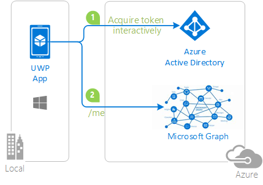

---
languages:
- csharp
- powershell
page_type: sample
description: "This sample shows how to use the Microsoft Authentication Library for .NET to get an access token and call the Microsoft Graph from a UWP app."
products:
- azure
- azure-active-directory
- windows
- windows-uwp
- office-ms-graph
urlFragment: uwp-signing-in-graph-aad
---

# Universal Windows Platform application signing in users with Microsoft and calling the Microsoft Graph


| [Getting Started](https://docs.microsoft.com/en-us/azure/active-directory/develop/quickstart-v2-uwp)| [Library](https://github.com/AzureAD/microsoft-authentication-library-for-dotnet/wiki) | [Docs](https://aka.ms/aadv2) | [Support](README.md#community-help-and-support)
| --- | --- | --- | --- |

## About this sample

### Overview

This simple sample demonstrates how to use the [Microsoft Authentication Library (MSAL) for .NET](https://github.com/AzureAD/microsoft-authentication-library-for-dotnet) to get an access token and call the Microsoft Graph using MS Graph SDK from a Universal Windows Platform (UWP) application.

1. The .NET client UWP application uses the Microsoft Authentication Library (MSAL) to obtain a JWT access token from Azure Active Directory (Azure AD):
2. The access token is used as a bearer token to authenticate the user when calling the Microsoft Graph.



## Steps to run

You can get full explanation about this sample, and build it from scratch by going to [Call the Microsoft Graph API from a Universal Windows Platform (UWP) application](https://docs.microsoft.com/en-us/azure/active-directory/develop/quickstart-v2-uwp).
You would have to change a few things (see below, build from scratch)

## How to run this sample

To run this sample, you'll need:

- [Visual Studio 2017](https://aka.ms/vsdownload)
- An Internet connection
- An Azure Active Directory (Azure AD) tenant. For more information on how to get an Azure AD tenant, see [How to get an Azure AD tenant](https://azure.microsoft.com/en-us/documentation/articles/active-directory-howto-tenant/)
- A user account in your Azure AD tenant or a Microsoft account (formerly Windows Live account). Therefore, if you signed in to the [Azure portal](https://portal.azure.com) with a Microsoft account and have never created a user account in your directory before, you need to do that now.

### Step 1:  Clone or download this repository

From your shell or command line:

   ```Shell
   git clone https://github.com/Azure-Samples/active-directory-dotnet-native-uwp-v2.git
   ```

or download and exact the repository .zip file.

> Given that the name of the sample is pretty long, and so are the name of the referenced NuGet packages, you might want to clone it in a folder close to the root of your hard drive, to avoid file size limitations on Windows.

### Step 2:  Register the sample application with your Azure Active Directory tenant

There is one project in this sample. To register it, you can:

- either follow the steps [Step 2: Register the sample with your Azure Active Directory tenant](#step-2-register-the-sample-with-your-azure-active-directory-tenant) and [Step 3:  Configure the sample to use your Azure AD tenant](#choose-the-azure-ad-tenant-where-you-want-to-create-your-applications)
- or use PowerShell scripts that:
  - **automatically** creates the Azure AD applications and related objects (passwords, permissions, dependencies) for you
  - modify the Visual Studio projects' configuration files.

If you want to use this automation:
1. On Windows run PowerShell and navigate to the root of the cloned directory
1. In PowerShell run:
   ```PowerShell
   Set-ExecutionPolicy -ExecutionPolicy RemoteSigned -Scope Process -Force
   ```
1. Run the script to create your Azure AD application and configure the code of the sample application accordinly. 
   ```PowerShell
   .\AppCreationScripts\Configure.ps1
   ```
   > Other ways of running the scripts are described in [App Creation Scripts](./AppCreationScripts/AppCreationScripts.md)

1. Open the Visual Studio solution and click start

If ou don't want to use this automation, follow the steps below

#### Choose the Azure AD tenant where you want to create your applications

As a first step you'll need to:

1. Sign in to the [Azure portal](https://portal.azure.com) using either a work or school account or a personal Microsoft account.
1. If your account is present in more than one Azure AD tenant, select `Directory + Subscription` at the top right corner in the menu on top of the page, and switch your portal session to the desired Azure AD tenant.   

#### Register the uwpApp app (UWP-App-calling-MSGraph)

1. Navigate to the Microsoft identity platform for developers [App registrations](https://go.microsoft.com/fwlink/?linkid=2083908) page.
1. Select **New registration**.
   - In the **Name** section, enter a meaningful application name that will be displayed to users of the app, for example `UWP-App-calling-MSGraph`.
   - In the **Supported account types** section, select **Accounts in any organizational directory and personal Microsoft accounts (e.g. Skype, Xbox, Outlook.com)**.
   - Select **Register** to create the application.
1. On the app **Overview** page, find the **Application (client) ID** value and record it for later. You'll need it to configure the Visual Studio configuration file for this project.
1. In the list of pages for the app, select **Authentication**.
   -  1. In the **Suggested Redirect URIs for public clients (mobile, desktop)** list, check **https://login.microsoftonline.com/common/oauth2/nativeclient**.
1. Select **Save**.
1. In the list of pages for the app, select **API permissions**
   - Click the **Add a permission** button and then,
   - Ensure that the **Microsoft APIs** tab is selected
   - In the *Commonly used Microsoft APIs* section, click on **Microsoft Graph**
   - In the **Delegated permissions** section, ensure that the right permissions are checked: **User.Read**. Use the search box if necessary.
   - Select the **Add permissions** button


### Step 3:  Configure the sample to use your Azure AD tenant

In the steps below, "ClientID" is the same as "Application ID" or "AppId".

Open the solution in Visual Studio to configure the projects

#### Configure the sample to use your Azure AD app

   1. In the `App.xaml.cs` file from the cloned repo, set your application/client ID copied from the App Registration Portal where you will have registered an application and added the native platform.

      ``private const string ClientId = "[Application Id pasted from the application registration portal]"``

1. (Optionally): Enable Windows Integrated Authentication when using a federated Azure AD tenant

    Out of the box, this sample is not configured to work with Integrated Windows Authentication (IWA) when used with a federated Azure Active Directory domain. To work with IWA the application manifest must enable additional capabilities. These capabilities are not configured by default for this sample because applications requesting the Enterprise Authentication or Shared User Certificates capabilities require a higher level of verification to be accepted into the Windows Store, and not all developers may wish to perform the higher level of verification.
    To enable Windows-Integrated Authentication, in Package.appxmanifest, in the Capabilities tab, enable:

        - Enterprise Authentication
        - Private Networks (Client & Server)
        - Shared User Certificates
    Also, `MainPage.xaml.cs`, when building the application, ensure that the following line of code: ```.WithUseCorporateNetwork(true)```

### Step 4: Run the sample
1. Run the application from Visual Studio (Debug | Start without Debugging), directly on the local machine, or after deploying to a device or an emulator.

### Known limitation: on Windows 10, you cannot sign in with your windows hello PIN

If sign-in with your work or school account and your organization requires conditional access, you are asked to provide a certificate:

- If you have not enabled UWP-specific considerations above, you will get this error:
    ```Text
    No valid client certificate found in the request.
    No valid certificates found in the user's certificate store.
    Please try again choosing a different authentication method.
    ```
- On Windows 10 desktop UWP application, if you enabled the settings described above, the list of certificates is presented, however if you choose to use your PIN, the PIN window is never presented. This is a known limitation with Web authentication broker in UWP applications running on Windows 10 (this works fine on Windows Phone 10). As a work-around, you will need to click on the **sign-in with other options** link and then choose **Sign-in with a username and password instead**, provide your password and go through the phone authentication.

- we plan to remove this limitation in the future by integrating the Web Account Manager (WAM)

## Steps to build from scratch

Follow the instructions given in [Windows desktop .NET guided walkthrough](https://docs.microsoft.com/azure/active-directory/develop/guidedsetups/active-directory-mobileanddesktopapp-windowsdesktop-intro), but:

- Instead of creating a WPF project, you will need to create a **UWP** project
- Instead of using a Label in the `MainWindow.xaml`, you will need to use a **TextBock** (as Labels are not supported in the UWP platform). Instead of the Label Content property, use the TextBlock's **Text** property
- With UWP applications, you don't need to add a cache as it's already managed by MSAL.Net

## Community help and support

We use [Stack Overflow](http://stackoverflow.com/questions/tagged/msal) with the community to provide support. We highly recommend you ask your questions on Stack Overflow first and browse existing issues to see if someone has asked your question before. Make sure that your questions or comments are tagged with [msal.dotnet].

If you find and bug in the sample please raise the issue on [GitHub Issues](../../issues).

If you find a bug in msal.Net, please raise the issue on [MSAL.NET GitHub Issues](https://github.com/AzureAD/microsoft-authentication-library-for-dotnet/issues).

To provide a recommendation, visit our [User Voice page](https://feedback.azure.com/forums/169401-azure-active-directory).

## Contributing

If you'd like to contribute to this sample, see [CONTRIBUTING.MD](/CONTRIBUTING.md).

This project has adopted the [Microsoft Open Source Code of Conduct](https://opensource.microsoft.com/codeofconduct/). For more information see the [Code of Conduct FAQ](https://opensource.microsoft.com/codeofconduct/faq/) or contact [opencode@microsoft.com](mailto:opencode@microsoft.com) with any additional questions or comments.

## More information

For more information see MSAL.NET's conceptual documentation:

- [Quickstart: Register an application with the Microsoft identity platform (Preview)](https://docs.microsoft.com/azure/active-directory/develop/quickstart-register-app)
- [Quickstart: Configure a client application to access web APIs (Preview)](https://docs.microsoft.com/azure/active-directory/develop/quickstart-configure-app-access-web-apis)
- [Recommended pattern to acquire a token in public client applications](https://github.com/AzureAD/microsoft-authentication-library-for-dotnet/wiki/AcquireTokenSilentAsync-using-a-cached-token#recommended-call-pattern-in-public-client-applications)
- [Acquiring tokens interactively in public client applications](https://github.com/AzureAD/microsoft-authentication-library-for-dotnet/wiki/Acquiring-tokens-interactively)
